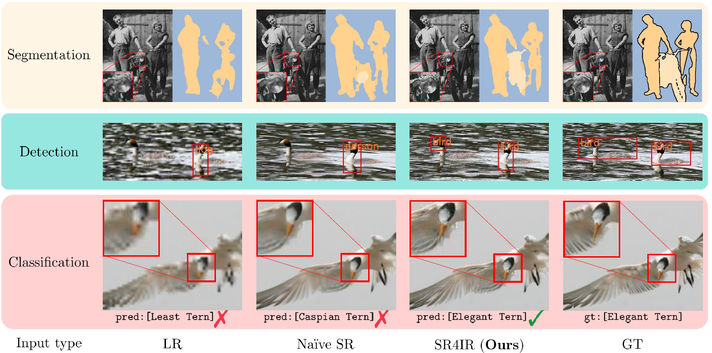

# SR4IR [CVPR 2024]
This repository is an official implementation of the paper **"Beyond Image Super-Resolution for Image Recognition with Task-Driven Perceptual Loss** (CVPR 2024)". [[**arXiv**](https://arxiv.org/abs/2404.01692)]

### Update
[**2026.02.17**] Added SonarSR integration, 1-channel detector support, and evaluation scripts for sonar object detection.

[**2025.08.01**] Our follow-up paper [Exploiting Diffusion Prior for Task-driven Image Restoration](https://www.arxiv.org/abs/2507.22459) is accepted to ICCV 2025! :tada: The code is available at [here](https://github.com/JaehaKim97/EDTR). :blush:

### Abstract
>In real-world scenarios, image recognition tasks, such as semantic segmentation and object detection, often pose greater challenges due to the lack of information available within low-resolution (LR) content. Image super-resolution (SR) is one of the promising solutions for addressing the challenges. However, due to the ill-posed property of SR, it is challenging for typical SR methods to restore task-relevant high-frequency contents, which may dilute the advantage of utilizing the SR method. Therefore, in this paper, we propose **S**uper-**R**esolution **f**or **I**mage **R**ecognition (SR4IR) that effectively guides the generation of SR images beneficial to achieving satisfactory image recognition performance when processing LR images. The critical component of our SR4IR is the task-driven perceptual (TDP) loss that enables the SR network to acquire task-specific knowledge from a network tailored for a specific task. Moreover, we propose a cross-quality patch mix and an alternate training framework that significantly enhances the efficacy of the TDP loss by addressing potential problems when employing the TDP loss. Through extensive experiments, we demonstrate that our SR4IR achieves outstanding task performance by generating SR images useful for a specific image recognition task, including semantic segmentation, object detection, and image classification.


<div align="center">
(Input type of LR, Naive SR stands for L->T, S->T setting in our main manuscript)
</div>

## Instructions

Please follow the below instructions.

1. [**Installation**](assets/docs/Installation.md)
2. [**Training**](assets/docs/Training.md) (skip if test-only)
3. [**Testing**](assets/docs/Testing.md) (including pre-trained models)

---

## Sonar Detection Extension (2026.02.17)

### Overview

This extension adds support for sonar image object detection with:
- **SonarSR**: Denoising + Super-Resolution model with window attention
- **1-channel detector**: MobileNetV3-Large based Faster R-CNN for grayscale sonar images
- **Multi-Scale Object-Aware TDP Loss**: Object-weighted feature matching

### Training Configs

| Config | Description |
|--------|-------------|
| `options/det/train_sonarsr_window.yml` | SonarSR with window attention (recommended, faster) |
| `options/det/train_sonarsr_global.yml` | SonarSR with global attention (slower, more context) |
| `options/det/train_srdn_sonar.yml` | SRDN baseline for sonar |

### Key Parameters

```yaml
# SonarSR Network Settings
network_sr:
  name: sonarsr
  denoiser_attn_type: window  # or 'global'
  sr_attn_type: none
  denoiser_global_residual: true
  sr_use_bicubic_residual: true

# Noise Settings (match pretrained SonarSR)
train:
  noise_min_L: 0.2
  noise_max_L: 0.5

# Evaluation Settings
data:
  eval_focus_only: true  # Evaluate on focus images only for fair comparison
```

### Evaluation Scripts

**Detector-only evaluation:**
```bash
# Full dataset
CUDA_VISIBLE_DEVICES=0 python eval_det.py --opt options/eval/eval_det.yml

# Focus images only
CUDA_VISIBLE_DEVICES=0 python eval_det.py --opt options/eval/eval_det.yml --focus_only

# Custom batch size
CUDA_VISIBLE_DEVICES=0 python eval_det.py --opt options/eval/eval_det.yml --batch_size 16
```

**SR4IR + Detector evaluation:**
```bash
CUDA_VISIBLE_DEVICES=0 python eval_detector_with_sr.py --gpu 0
```

### Evaluation Config

Edit `options/eval/eval_det.yml` to change checkpoint path:
```yaml
path:
  # SR4IR trained detector
  network_det: experiments/det/sonarsr_window_wowbatch/models/net_det_best.pth
  # Or baseline detector
  # network_det: runs_det_pure1ch_pretrained/best_map.pth
```

### Training

```bash
# 2 GPU training
CUDA_VISIBLE_DEVICES=0,1 torchrun --nproc_per_node=2 --master_port=29500 \
    src/main.py --opt options/det/train_sonarsr_window.yml
```

### Results

| Model | mAP | mAP@50 | mAP@75 |
|-------|-----|--------|--------|
| Baseline (HR detector) | 0.63 | 0.97 | 0.67 |
| SR4IR + SonarSR (window) | **0.80** | **0.98** | **0.91** |

---

## Citation

If you find our work helpful for your research, please cite our paper.

```
@inproceedings{kim2024SR4IR,
  title={Beyond Image Super-Resolution for Image Recognition with Task-Driven Perceptual Loss},
  author={Kim, Jaeha and Oh, Junghun and Lee, Kyoung Mu},
  booktitle={Proceedings of the IEEE Conference on Computer Vision and Pattern Recognition},
  year={2024}
}
```

## Acknowledgement

Our code implementations are motivated by the below codes. We thank the authors for sharing the awesome repositories.
- [TorchVision](https://github.com/pytorch/vision/tree/main/references)
- [BasicSR](https://github.com/XPixelGroup/BasicSR)
- [VOC2COCO](https://github.com/yukkyo/voc2coco)


## Contact
If you have any questions, please email `jhkim97s2@gmail.com`.

